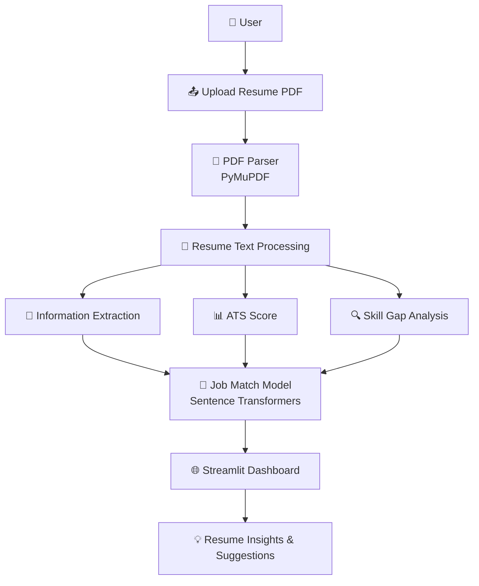
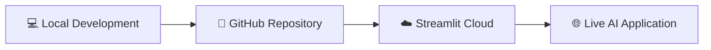

<div align="center">

# 🚀 ResumeIQ AI
### *Intelligent Resume Analyzer*

**Your resume, decoded — before the recruiter even sees it.**

An AI-powered resume analysis platform that extracts resume insights, evaluates ATS compatibility, identifies skill gaps, and provides personalized improvement recommendations.

<br>


<br>

[**🔗 Live Demo**](https://resumeiq-ai-nssmnqpuwft6tcrjsiz6py.streamlit.app) &nbsp;•&nbsp; [**📁 GitHub Repository**](https://github.com/SHALINISAURAV/ResumeIQ-AI)

</div>

<br>

---

## 📚 Table of Contents

- [Overview](#-overview)
- [Why ResumeIQ?](#-why-resumeiq)
- [Problem Statement](#-problem-statement)
- [Features](#-features)
- [System Architecture](#️-system-architecture)
- [Tech Stack](#️-tech-stack)
- [AI Engineering Concepts Demonstrated](#-ai-engineering-concepts-demonstrated)
- [Project Structure](#-project-structure)
- [Installation & Setup](#️-installation--setup)
- [Deployment](#-deployment)
- [Screenshots](#-screenshots)
- [Future Improvements](#-future-improvements)
- [Key Highlights](#-key-highlights)
- [License](#-license)
- [Author](#-author)

---

## 📌 Overview

**ResumeIQ AI** is an AI-powered Resume Analyzer built using Python, Streamlit, and open-source NLP technologies.

Every resume tells a story — but not every resume tells it in a way that an Applicant Tracking System (ATS) or a busy recruiter can quickly understand. ResumeIQ AI acts as a first-pass reviewer: parsing the document, understanding its content, and scoring it against real-world expectations, all before it ever reaches a human.

The application helps job seekers understand how well their resume matches industry expectations by analyzing:

- 🧱 Resume structure
- 🛠️ Technical skills
- 🎯 Job-role compatibility
- 🤖 ATS readiness
- 🕳️ Missing skills
- 📈 Improvement opportunities

The project combines **Natural Language Processing (NLP), rule-based scoring systems, and machine learning techniques** to create an explainable resume evaluation system — no black-box scores, just clear, actionable feedback.

---

## 🌟 Why ResumeIQ?

Most resume checkers give a single opaque score and little else. ResumeIQ AI is designed to be **explainable end-to-end**: every score comes with a "why," every gap comes with a "what to do about it." It's built for job seekers who want to understand their resume the way a hiring pipeline actually sees it — structurally, semantically, and competitively.

> *A resume isn't just a document — it's the first algorithm you have to pass before you meet a human.*

---

## 🎯 Problem Statement

Many candidates submit resumes without knowing:

- ❓ Whether their resume is ATS-friendly
- ❓ Which skills they are missing for a target role
- ❓ How closely their resume matches job requirements
- ❓ What improvements can increase their chances

**ResumeIQ AI solves this by providing instant AI-assisted feedback** — turning uncertainty into a clear, prioritized action plan.

---

## ✨ Features

### 📄 Resume Processing

- 📤 Upload PDF resumes
- 📝 Extract resume text using **PyMuPDF**
- ⚙️ Process and analyze resume content automatically

---

### 🧠 Information Extraction

Extracts important resume information:

| Field | Extracted |
|---|---|
| 👤 Name | ✅ |
| 📧 Email | ✅ |
| 📱 Phone number | ✅ |
| 🛠️ Skills | ✅ |
| 🎓 Education | ✅ |
| 💼 Experience | ✅ |
| 📁 Projects | ✅ |

---

### 📊 ATS Score Analysis

Generates an ATS compatibility score based on:

- 📋 Resume completeness
- 📧 Contact information
- 🛠️ Technical skills
- 🎓 Education
- 💼 Experience
- 📁 Projects

Includes **visual score representation using Plotly** — so the score isn't just a number, it's a picture.

---

### 🔍 Skill Gap Detection

Analyzes missing skills based on selected career roles.

**Supported roles:**

- 🤖 AI Engineer
- 📊 Data Scientist
- 🧠 Machine Learning Engineer
- 🐍 Python Developer
- 📈 Data Analyst

**Provides:**

- ✅ Existing skills
- ❌ Missing skills
- 📚 Recommended learning areas

---

### 🎯 Job Match Prediction

Measures similarity between:

- 📄 Resume content
- 📋 Target job description

**Using:**

- 🧬 Sentence Transformers embeddings
- 🔢 TF-IDF similarity fallback

**Outputs:**

- 📊 Job compatibility percentage
- 🎯 Matching areas

---

### 💡 Resume Improvement Suggestions

Provides actionable recommendations, such as:

- ➕ Add missing projects
- 🐙 Include GitHub profile
- 🏅 Add certifications
- 🛠️ Improve technical skills section
- ✍️ Strengthen resume summary
- 📊 Include measurable achievements

---

## 🏗️ System Architecture



---

## 🛠️ Tech Stack

| Category | Tools |
|---|---|
| **Programming** | Python |
| **Frontend** | Streamlit |
| **NLP & Machine Learning** | spaCy, Sentence Transformers, scikit-learn |
| **Data Processing** | Pandas, NumPy |
| **Visualization** | Plotly |
| **Document Processing** | PyMuPDF |

---

## 🧠 AI Engineering Concepts Demonstrated

This project demonstrates practical AI engineering skills:

- ✅ PDF document processing
- ✅ Natural Language Processing pipeline
- ✅ Information extraction
- ✅ Semantic similarity matching
- ✅ Hybrid AI systems *(rule-based logic + Machine Learning)*
- ✅ Explainable scoring systems
- ✅ Model fallback strategies
- ✅ Deployment of AI applications

---

## 📂 Project Structure

```text
ResumeIQ-AI/
├── app.py                          # Streamlit application
├── requirements.txt                 # Dependencies
├── README.md                       # Documentation
├── assets/
│   └── screenshots/                 # App screenshots
├── components/
│   └── ui.py                       # UI components
├── parsers/
│   └── pdf_parser.py                # PDF extraction logic
├── analysis/
│   ├── ats_score.py                 # ATS scoring logic
│   ├── information_extraction.py    # Resume field extraction
│   ├── job_match.py                 # Job similarity matching
│   ├── skill_gap.py                 # Skill gap detection
│   └── suggestions.py               # Improvement recommendations
├── data/
│   └── job_descriptions.py          # Reference job descriptions
└── utils/                          # Helper utilities
```

---

## ⚙️ Installation & Setup

### 1️⃣ Clone Repository

```bash
git clone https://github.com/SHALINISAURAV/ResumeIQ-AI.git
```

### 2️⃣ Navigate to Project Folder

```bash
cd ResumeIQ-AI
```

### 3️⃣ Create Virtual Environment

```bash
python3 -m venv .venv
```

### 4️⃣ Activate Environment

**Mac/Linux**
```bash
source .venv/bin/activate
```

**Windows**
```bash
.venv\Scripts\activate
```

### 5️⃣ Install Dependencies

```bash
pip install -r requirements.txt
```

### 6️⃣ Run Application

```bash
streamlit run app.py
```

### 7️⃣ Open in Browser

```
http://localhost:8501
```

---

## 🚀 Deployment

The application is deployed using **Streamlit Community Cloud**.

**Live Application:**
🔗 [https://resumeiq-ai-nssmnqpuwft6tcrjsiz6py.streamlit.app](https://resumeiq-ai-nssmnqpuwft6tcrjsiz6py.streamlit.app)

### Deployment Workflow



---

## 📸 Screenshots

*(Add screenshots after deployment)*

```
assets/screenshots/
├── home.png
├── analysis-results.png
└── skill-gap.png
```

---

## 🔮 Future Improvements

- [ ] 🤖 Resume improvement suggestions powered by LLMs
- [ ] 🖨️ OCR support for scanned resumes
- [ ] 📑 Multiple resume comparison
- [ ] 🌐 Real-time job scraping
- [ ] 🗺️ Personalized learning roadmap
- [ ] 🔐 User authentication
- [ ] 🏆 Resume ranking system

---

## 📌 Key Highlights

- ⭐ Built an end-to-end AI application from scratch
- ⭐ Implemented NLP-based resume understanding
- ⭐ Designed hybrid AI architecture using rules + ML
- ⭐ Developed explainable ATS scoring system
- ⭐ Integrated semantic similarity models
- ⭐ Deployed a production-ready Streamlit application

---

## 📜 License

This project is created for **educational and portfolio purposes**.

---

## 👩‍💻 Author

<div align="center">

**Shalini Saurav**

AI & Data Science Enthusiast

Interested in: 🤖 Artificial Intelligence &nbsp;•&nbsp; 📊 Machine Learning &nbsp;•&nbsp; ✨ Generative AI &nbsp;•&nbsp; ⚙️ AI Engineering

[](https://github.com/SHALINISAURAV)

<br>

### ⭐ If you found this project useful, consider giving it a star on GitHub!

</div>
